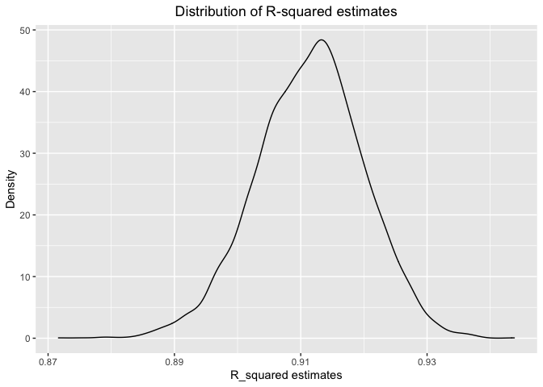

p8105_hw6_jz3571
================
Junyan Zhu
2022-11-29

``` r
library(tidyverse)
library(modelr)
```

## Problem 1

``` r
weather_df = 
  rnoaa::meteo_pull_monitors(
    c("USW00094728"),
    var = c("PRCP", "TMIN", "TMAX"), 
    date_min = "2017-01-01",
    date_max = "2017-12-31") %>%
  mutate(
    name = recode(id, USW00094728 = "CentralPark_NY"),
    tmin = tmin / 10,
    tmax = tmax / 10) %>%
  select(name, id, everything())
```

    ## Registered S3 method overwritten by 'hoardr':
    ##   method           from
    ##   print.cache_info httr

    ## using cached file: ~/Library/Caches/R/noaa_ghcnd/USW00094728.dly

    ## date created (size, mb): 2022-09-29 10:34:56 (8.401)

    ## file min/max dates: 1869-01-01 / 2022-09-30

#### Draw 5000 bootstrap samples and estimates R-square for each

``` r
bootstrap_df = 
  weather_df %>% 
  bootstrap(n = 5000, id = "strap_number")

rsquare_df = 
  bootstrap_df %>% 
  mutate(
    models = map(strap, ~ lm(tmax ~ tmin, data = .x)),
    results = map(models, broom::glance)
    ) %>% 
  unnest(results) %>% 
  select(strap_number, r.squared)
```

#### Plot the distribution of R-square estimates

``` r
rsquare_df %>% 
  ggplot(aes(x = r.squared)) +
  geom_density() +
  labs(x = "R_squared estimates",
       y = "Density",
       title = "Distribution of R-squared estimates") +
  theme(plot.title = element_text(hjust = 0.5))
```

<!-- -->
