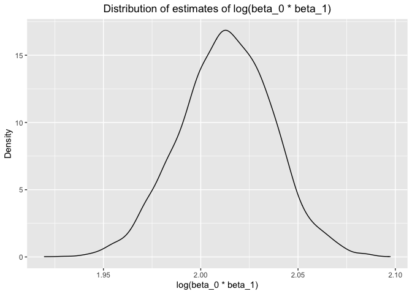

p8105_hw6_jz3571
================
Junyan Zhu
2022-11-29

``` r
library(tidyverse)
library(modelr)
```

## Problem 1

``` r
weather_df = 
  rnoaa::meteo_pull_monitors(
    c("USW00094728"),
    var = c("PRCP", "TMIN", "TMAX"), 
    date_min = "2017-01-01",
    date_max = "2017-12-31") %>%
  mutate(
    name = recode(id, USW00094728 = "CentralPark_NY"),
    tmin = tmin / 10,
    tmax = tmax / 10) %>%
  select(name, id, everything())
```

    ## Registered S3 method overwritten by 'hoardr':
    ##   method           from
    ##   print.cache_info httr

    ## using cached file: ~/Library/Caches/R/noaa_ghcnd/USW00094728.dly

    ## date created (size, mb): 2022-09-29 10:34:56 (8.401)

    ## file min/max dates: 1869-01-01 / 2022-09-30

#### Draw 5000 bootstrap samples and estimate R-square for each

``` r
bootstrap_df = 
  weather_df %>% 
  bootstrap(n = 5000, id = "strap_number")

rsquare_df = 
  bootstrap_df %>% 
  mutate(
    models = map(strap, ~ lm(tmax ~ tmin, data = .x)),
    results = map(models, broom::glance)
    ) %>% 
  unnest(results) %>% 
  select(strap_number, r.squared)
```

#### Plot the distribution of estimated R-square

``` r
rsquare_df %>% 
  ggplot(aes(x = r.squared)) +
  geom_density() +
  labs(x = "R_squared estimates",
       y = "Density",
       title = "Distribution of R-squared estimates") +
  theme(plot.title = element_text(hjust = 0.5))
```

<!-- -->

#### 95% CI for R-squared

``` r
quantile(rsquare_df$r.squared, c(0.025, 0.975))
```

    ##      2.5%     97.5% 
    ## 0.8943513 0.9273720

#### Produce estimates of log(beta_0 \* beta_1) for each bootstrap sample

``` r
log_df = 
  bootstrap_df %>% 
  mutate(
    models = map(strap, ~ lm(tmax ~ tmin, data = .x)),
    results = map(models, broom::tidy)
    ) %>% 
  unnest(results) %>% 
  select(strap_number, term, estimate) %>% 
  pivot_wider(
    names_from = "term",
    values_from = "estimate"
  ) %>% 
  janitor::clean_names() %>% 
  rename(beta_0 = intercept, beta_1 = tmin) %>% 
  mutate(log_beta0_times_beta1 = log(beta_0 * beta_1))
```

#### Plot the distribution of estimates of log(beta_0 \* beta_1)

``` r
log_df %>% 
  ggplot(aes(x = log_beta0_times_beta1)) +
  geom_density() +
  labs(x = "log(beta_0 * beta_1)",
       y = "Density",
       title = "Distribution of estimates of log(beta_0 * beta_1)") +
  theme(plot.title = element_text(hjust = 0.5))
```

<!-- -->

#### 95% CI for log(beta_0 \* beta_1)

``` r
quantile(log_df$log_beta0_times_beta1, c(0.025, 0.975))
```

    ##     2.5%    97.5% 
    ## 1.965428 2.060161

## Problem 2

``` r
homicide_df = read_csv("./data/homicide-data.csv")
```

    ## Rows: 52179 Columns: 12
    ## ── Column specification ────────────────────────────────────────────────────────
    ## Delimiter: ","
    ## chr (9): uid, victim_last, victim_first, victim_race, victim_age, victim_sex...
    ## dbl (3): reported_date, lat, lon
    ## 
    ## ℹ Use `spec()` to retrieve the full column specification for this data.
    ## ℹ Specify the column types or set `show_col_types = FALSE` to quiet this message.

#### Create a city_state variable and clean data

``` r
homicide_clean = homicide_df %>% 
  mutate(city_state = str_c(city, state, sep = "_"),
         victim_age = as.numeric(victim_age),
         resolved = case_when(
           disposition == "Closed without arrest" ~ 0,
           disposition == "Open/No arrest" ~ 0,
           disposition == "Closed by arrest" ~ 1
         ) ) %>% 
  filter(victim_race %in% c("Black", "White"),
         city_state != "Tulsa_AL",
         city_state != "Dallas_TX",
         city_state != "Phoenix_AZ",
         city_state != "Kansas City_MO") %>% 
   select(city_state, resolved, victim_age, victim_race, victim_sex)
```

    ## Warning in mask$eval_all_mutate(quo): NAs introduced by coercion
