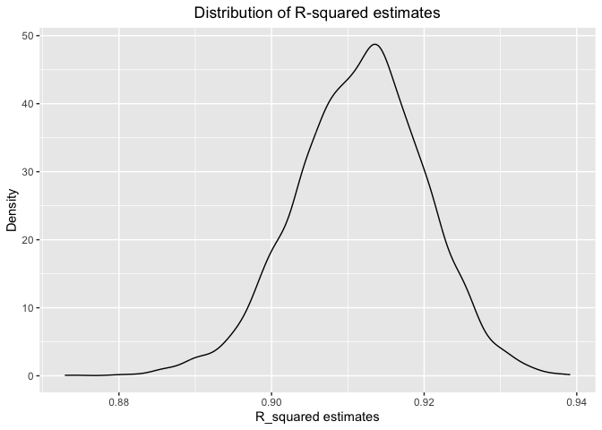

p8105_hw6_jz3571
================
Junyan Zhu
2022-11-29

``` r
library(tidyverse)
library(modelr)
```

## Problem 1

``` r
weather_df = 
  rnoaa::meteo_pull_monitors(
    c("USW00094728"),
    var = c("PRCP", "TMIN", "TMAX"), 
    date_min = "2017-01-01",
    date_max = "2017-12-31") %>%
  mutate(
    name = recode(id, USW00094728 = "CentralPark_NY"),
    tmin = tmin / 10,
    tmax = tmax / 10) %>%
  select(name, id, everything())
```

    ## Registered S3 method overwritten by 'hoardr':
    ##   method           from
    ##   print.cache_info httr

    ## using cached file: ~/Library/Caches/R/noaa_ghcnd/USW00094728.dly

    ## date created (size, mb): 2022-09-29 10:34:56 (8.401)

    ## file min/max dates: 1869-01-01 / 2022-09-30

#### Draw 5000 bootstrap samples and estimate R-square for each

``` r
bootstrap_df = 
  weather_df %>% 
  bootstrap(n = 5000, id = "strap_number")

rsquare_df = 
  bootstrap_df %>% 
  mutate(
    models = map(strap, ~ lm(tmax ~ tmin, data = .x)),
    results = map(models, broom::glance)
    ) %>% 
  unnest(results) %>% 
  select(strap_number, r.squared)
```

#### Plot the distribution of estimated R-square

``` r
rsquare_df %>% 
  ggplot(aes(x = r.squared)) +
  geom_density() +
  labs(x = "R_squared estimates",
       y = "Density",
       title = "Distribution of R-squared estimates") +
  theme(plot.title = element_text(hjust = 0.5))
```

<!-- -->

#### 95% CI for R-squared

``` r
quantile(rsquare_df$r.squared, c(0.025, 0.975))
```

    ##      2.5%     97.5% 
    ## 0.8943513 0.9273720

#### Produce estimates of log(beta_0 \* beta_1) for each bootstrap sample

``` r
log_df = 
  bootstrap_df %>% 
  mutate(
    models = map(strap, ~ lm(tmax ~ tmin, data = .x)),
    results = map(models, broom::tidy)
    ) %>% 
  unnest(results) %>% 
  select(strap_number, term, estimate) %>% 
  pivot_wider(
    names_from = "term",
    values_from = "estimate"
  ) %>% 
  janitor::clean_names() %>% 
  rename(beta_0 = intercept, beta_1 = tmin) %>% 
  mutate(log_beta0_times_beta1 = log(beta_0 * beta_1))
```

#### Plot the distribution of estimates of log(beta_0 \* beta_1)

``` r
log_df %>% 
  ggplot(aes(x = log_beta0_times_beta1)) +
  geom_density() +
  labs(x = "log(beta_0 * beta_1)",
       y = "Density",
       title = "Distribution of estimates of log(beta_0 * beta_1)") +
  theme(plot.title = element_text(hjust = 0.5))
```

<!-- -->

From the graphs pf distribution above, we can see the distribution of R
square is basically normal and mean is about 0.91. Besides, the the plot
of log(beta_0 \* beta_1) shows that the value of the value of log(beta_0
\* beta_1) is also normally distributed around the 2.03.

#### 95% CI for log(beta_0 \* beta_1)

``` r
quantile(log_df$log_beta0_times_beta1, c(0.025, 0.975))
```

    ##     2.5%    97.5% 
    ## 1.965428 2.060161

## Problem 2

``` r
homicide_df = read_csv("./data/homicide-data.csv")
```

    ## Rows: 52179 Columns: 12
    ## ── Column specification ────────────────────────────────────────────────────────
    ## Delimiter: ","
    ## chr (9): uid, victim_last, victim_first, victim_race, victim_age, victim_sex...
    ## dbl (3): reported_date, lat, lon
    ## 
    ## ℹ Use `spec()` to retrieve the full column specification for this data.
    ## ℹ Specify the column types or set `show_col_types = FALSE` to quiet this message.

#### Create a city_state variable and clean data

``` r
homicide_clean = homicide_df %>% 
  mutate(city_state = str_c(city, state, sep = "_"),
         victim_age = as.numeric(victim_age),
         resolved = case_when(
           disposition == "Closed without arrest" ~ 0,
           disposition == "Open/No arrest" ~ 0,
           disposition == "Closed by arrest" ~ 1
         ) ) %>% 
  filter(victim_race %in% c("Black", "White"),
         city_state != "Tulsa_AL",
         city_state != "Dallas_TX",
         city_state != "Phoenix_AZ",
         city_state != "Kansas City_MO") %>% 
   select(city_state, resolved, victim_age, victim_race, victim_sex)
```

    ## Warning in mask$eval_all_mutate(quo): NAs introduced by coercion

#### Fit a logistic regression for resolved vs unresolved for the city of Baltimore_MD

``` r
baltimore_df = 
  homicide_clean %>% 
  filter(city_state =="Baltimore_MD") 

glm(resolved ~ victim_age + victim_race + victim_sex, data = baltimore_df, family = "binomial") %>% 
  broom::tidy() %>% 
  mutate(odd_ratio = exp(estimate),
         CI_lower = exp(estimate - 1.96*std.error),
         CI_upper = exp(estimate + 1.96*std.error)) %>% 
  select(term, odd_ratio, starts_with("CI")) %>% 
  knitr::kable(digit = 3)
```

| term             | odd_ratio | CI_lower | CI_upper |
|:-----------------|----------:|---------:|---------:|
| (Intercept)      |     1.363 |    0.975 |    1.907 |
| victim_age       |     0.993 |    0.987 |    1.000 |
| victim_raceWhite |     2.320 |    1.648 |    3.268 |
| victim_sexMale   |     0.426 |    0.325 |    0.558 |

#### Run glm for each of the cities in your dataset, and extract the adjusted odds ratio (and CI) for solving homicides comparing male victims to female victims.

``` r
all_glm = 
  homicide_clean %>% 
  nest(data = -city_state) %>% 
  mutate(
    models = map(.x = data, ~ glm(resolved ~ victim_age + victim_race + victim_sex, data = .x)),
    results = map(models, broom::tidy)
    ) %>% 
  unnest(results) %>% 
  filter(term == "victim_sexMale") %>% 
  mutate(odd_ratio = exp(estimate),
         CI_lower = exp(estimate - 1.96*std.error),
         CI_upper = exp(estimate + 1.96*std.error)) %>% 
  select(city_state, odd_ratio, starts_with("CI"))
  
all_glm %>% 
  knitr::kable(digit = 3)
```

| city_state        | odd_ratio | CI_lower | CI_upper |
|:------------------|----------:|---------:|---------:|
| Albuquerque_NM    |     1.139 |    0.963 |    1.348 |
| Atlanta_GA        |     1.001 |    0.915 |    1.094 |
| Baltimore_MD      |     0.816 |    0.766 |    0.868 |
| Baton Rouge_LA    |     0.802 |    0.702 |    0.917 |
| Birmingham_AL     |     0.967 |    0.874 |    1.069 |
| Boston_MA         |     0.924 |    0.806 |    1.060 |
| Buffalo_NY        |     0.859 |    0.751 |    0.982 |
| Charlotte_NC      |     0.977 |    0.895 |    1.067 |
| Chicago_IL        |     0.822 |    0.788 |    0.857 |
| Cincinnati_OH     |     0.825 |    0.739 |    0.921 |
| Columbus_OH       |     0.857 |    0.788 |    0.931 |
| Denver_CO         |     0.838 |    0.709 |    0.991 |
| Detroit_MI        |     0.876 |    0.828 |    0.926 |
| Durham_NC         |     0.955 |    0.811 |    1.124 |
| Fort Worth_TX     |     0.910 |    0.805 |    1.029 |
| Fresno_CA         |     1.063 |    0.890 |    1.270 |
| Houston_TX        |     0.919 |    0.866 |    0.976 |
| Indianapolis_IN   |     0.981 |    0.912 |    1.054 |
| Jacksonville_FL   |     0.922 |    0.858 |    0.991 |
| Las Vegas_NV      |     0.960 |    0.892 |    1.034 |
| Long Beach_CA     |     0.838 |    0.692 |    1.014 |
| Los Angeles_CA    |     0.905 |    0.828 |    0.989 |
| Louisville_KY     |     0.854 |    0.769 |    0.949 |
| Memphis_TN        |     0.938 |    0.880 |    0.999 |
| Miami_FL          |     0.855 |    0.757 |    0.966 |
| Milwaukee_wI      |     0.932 |    0.857 |    1.013 |
| Minneapolis_MN    |     0.987 |    0.833 |    1.169 |
| Nashville_TN      |     1.008 |    0.916 |    1.109 |
| New Orleans_LA    |     0.881 |    0.818 |    0.950 |
| New York_NY       |     0.764 |    0.676 |    0.863 |
| Oakland_CA        |     0.875 |    0.790 |    0.968 |
| Oklahoma City_OK  |     0.994 |    0.890 |    1.109 |
| Omaha_NE          |     0.840 |    0.747 |    0.944 |
| Philadelphia_PA   |     0.852 |    0.800 |    0.906 |
| Pittsburgh_PA     |     0.824 |    0.738 |    0.919 |
| Richmond_VA       |     1.003 |    0.870 |    1.155 |
| San Antonio_TX    |     0.922 |    0.807 |    1.053 |
| Sacramento_CA     |     0.916 |    0.787 |    1.067 |
| Savannah_GA       |     0.966 |    0.808 |    1.154 |
| San Bernardino_CA |     0.846 |    0.656 |    1.091 |
| San Diego_CA      |     0.841 |    0.730 |    0.968 |
| San Francisco_CA  |     0.901 |    0.782 |    1.037 |
| St. Louis_MO      |     0.917 |    0.855 |    0.983 |
| Stockton_CA       |     1.075 |    0.891 |    1.296 |
| Tampa_FL          |     0.949 |    0.771 |    1.168 |
| Tulsa_OK          |     0.995 |    0.902 |    1.098 |
| Washington_DC     |     0.915 |    0.834 |    1.004 |

#### Plot he estimated ORs and CIs for each city

``` r
all_glm %>% 
  mutate(city_state = fct_reorder(city_state, odd_ratio)) %>% 
  ggplot(aes(x = city_state, y = odd_ratio)) +
  geom_point() + 
  geom_errorbar(aes(ymin = CI_lower, ymax = CI_upper)) +
  theme(axis.text.x = element_text(angle = 90, vjust = 0.5, hjust = 1)) +
  labs(
    title = "Estimates Odd Ratio and CIs for Each City",
    x = "City, State",
    y = "Odd Ratio",
    caption = "Data from the Washington Post") +
   theme(plot.title = element_text(hjust = 0.5))
```

<!-- -->

## Problem 3

#### Load and clean the data for regression analysis

``` r
birthweight_df = read_csv("./data/birthweight.csv")
```

    ## Rows: 4342 Columns: 20
    ## ── Column specification ────────────────────────────────────────────────────────
    ## Delimiter: ","
    ## dbl (20): babysex, bhead, blength, bwt, delwt, fincome, frace, gaweeks, malf...
    ## 
    ## ℹ Use `spec()` to retrieve the full column specification for this data.
    ## ℹ Specify the column types or set `show_col_types = FALSE` to quiet this message.

``` r
bw_clean = 
  birthweight_df %>% 
  janitor::clean_names() %>% 
  mutate(
    babysex = factor(babysex),
    babysex = fct_recode(babysex, 
                         male = "1", 
                         female = "2"),
    frace = factor(frace),
    frace = fct_recode(frace, 
                       white = "1", 
                       black = "2", 
                       asian = "3", 
                       puerto_rican = "4", 
                       other = "8"),
    malform = factor(malform),
    malform = fct_recode(malform, 
                         absent = "0", 
                         present = "1"),
    mrace = factor(mrace),
    mrace = fct_recode(mrace, 
                       white = "1", 
                       black = "2",
                       asian = "3",
                       puerto_rican = "4"))

# check missing values
sum(is.na(bw_clean))
```

    ## [1] 0

The resulting dataset `bw_clean` contains 20 variables: babysex, bhead,
blength, bwt, delwt, fincome, frace, gaweeks, malform, menarche,
mheight, momage, mrace, parity, pnumlbw, pnumsga, ppbmi, ppwt, smoken,
wtgain. This dataset has 4342 observations and 0 missing value. Numeric
variables `babysex`, `frace`, `malform`, and `mrace` were converted into
factor variables.

#### Propose a regression model for birthweight

###### view the data

``` r
bw_clean %>% 
  lm(bwt ~ ., data =.) %>% 
  broom::tidy()
```

    ## # A tibble: 25 × 5
    ##    term               estimate std.error statistic   p.value
    ##    <chr>                 <dbl>     <dbl>     <dbl>     <dbl>
    ##  1 (Intercept)       -6265.      660.      -9.49   3.81e- 21
    ##  2 babysexfemale        28.7       8.47     3.39   7.02e-  4
    ##  3 bhead               131.        3.45    37.9    2.16e-271
    ##  4 blength              75.0       2.02    37.1    1.75e-261
    ##  5 delwt                 4.10      0.395   10.4    5.62e- 25
    ##  6 fincome               0.290     0.180    1.61   1.07e-  1
    ##  7 fraceblack           14.3      46.2      0.311  7.56e-  1
    ##  8 fraceasian           21.2      69.3      0.306  7.59e-  1
    ##  9 fracepuerto_rican   -47.0      44.7     -1.05   2.93e-  1
    ## 10 fraceother            4.30     74.1      0.0580 9.54e-  1
    ## # … with 15 more rows

###### use the both_way stepwise model selection

``` r
stepwise_model = step(lm(bwt ~ . ,data = bw_clean), direction = "both", trace = FALSE)
summary(stepwise_model)
```

    ## 
    ## Call:
    ## lm(formula = bwt ~ babysex + bhead + blength + delwt + fincome + 
    ##     gaweeks + mheight + mrace + parity + ppwt + smoken, data = bw_clean)
    ## 
    ## Residuals:
    ##      Min       1Q   Median       3Q      Max 
    ## -1097.18  -185.52    -3.39   174.14  2353.44 
    ## 
    ## Coefficients:
    ##                     Estimate Std. Error t value Pr(>|t|)    
    ## (Intercept)       -6098.8219   137.5463 -44.340  < 2e-16 ***
    ## babysexfemale        28.5580     8.4549   3.378 0.000737 ***
    ## bhead               130.7770     3.4466  37.944  < 2e-16 ***
    ## blength              74.9471     2.0190  37.120  < 2e-16 ***
    ## delwt                 4.1067     0.3921  10.475  < 2e-16 ***
    ## fincome               0.3180     0.1747   1.820 0.068844 .  
    ## gaweeks              11.5925     1.4621   7.929 2.79e-15 ***
    ## mheight               6.5940     1.7849   3.694 0.000223 ***
    ## mraceblack         -138.7925     9.9071 -14.009  < 2e-16 ***
    ## mraceasian          -74.8868    42.3146  -1.770 0.076837 .  
    ## mracepuerto_rican  -100.6781    19.3247  -5.210 1.98e-07 ***
    ## parity               96.3047    40.3362   2.388 0.017004 *  
    ## ppwt                 -2.6756     0.4274  -6.261 4.20e-10 ***
    ## smoken               -4.8434     0.5856  -8.271  < 2e-16 ***
    ## ---
    ## Signif. codes:  0 '***' 0.001 '**' 0.01 '*' 0.05 '.' 0.1 ' ' 1
    ## 
    ## Residual standard error: 272.3 on 4328 degrees of freedom
    ## Multiple R-squared:  0.7181, Adjusted R-squared:  0.7173 
    ## F-statistic: 848.1 on 13 and 4328 DF,  p-value: < 2.2e-16

According to the results from both_way stepwise model selection , we
have the optimal regression model: bwt \~ babysex + bhead + blength +
delwt + fincome + gaweeks + mheight + mrace + parity + ppwt + smoken.
The multiple r-squared is 0.7181, and adjusted r-squared is 0.7173. The
p value is smaller than 2.2e-16.

#### show a plot of model residuals against fitted values

``` r
residual_plot =
  bw_clean %>% 
  add_predictions(stepwise_model) %>% 
  add_residuals(stepwise_model) %>% 
  ggplot(aes(x = pred, y = resid)) +
  geom_point(alpha = 0.5) +
  geom_smooth(formula = 'y ~ x',method = "lm", se = FALSE) +
  labs(title = "Fitted Values vs. Residuals",
       x = "Fitted Values", 
       y = "Residuals",) +
  theme(plot.title = element_text(hjust = 0.5))
```

From the graph, we could see a big cluster of points around fitted
values equal 2000 - 4000 where the model residuals tend to evenly
distributed around 0.

#### Compare my model to two others

``` r
model_1 = lm(bwt ~ blength + gaweeks, data = bw_clean)

model_2 = lm(bwt ~ bhead * blength * babysex, data = bw_clean)
```

``` r
cv_df = 
  crossv_mc(bw_clean, 100) %>% 
  mutate(
    train = map(train, as_tibble),
    test = map(test, as_tibble)
  ) %>% 
  mutate(
    model_1  = map(train, ~lm(bwt ~ blength + gaweeks, data = .x)),
    model_2  = map(train, ~lm(bwt ~ bhead * blength * babysex, data = .x)),
    stepwise_model  = map(train, ~lm(bwt ~ babysex + bhead + blength + delwt + fincome + gaweeks + mheight + mrace + parity + ppwt + smoken, data = .x ))) %>% 
  mutate(
    rmse_model_1 = map2_dbl(model_1, test, ~rmse(model = .x, data = .y)),
    rmse_model_2    = map2_dbl(model_2, test, ~rmse(model = .x, data = .y)),
    rmse_stepwise = map2_dbl(stepwise_model, test, ~rmse(model = .x, data = .y)))
```

``` r
cv_df %>% 
  select(starts_with("rmse")) %>% 
  pivot_longer(
    everything(),
    names_to = "model",
    values_to = "rmse",
    names_prefix = "rmse_"
  ) %>% 
  mutate(model = fct_reorder(model, rmse)) %>% 
  ggplot(aes(x = model, y = rmse)) +
  geom_violin() +
  labs(title = "Cross Validation Comparisons",
       x = "Model",
       y = "RMSE") +
  theme(plot.title = element_text(hjust = 0.5))
```

<!-- -->

From the violin plot we can see that my model `stepwise_model` (bwt \~
babysex + bhead + blength + delwt + fincome + gaweeks + mheight +
mrace + parity + ppwt + smoken) has the lowest rmse than `model_1` (bwt
\~ blength + gaweeks) and `model_2` (bwt \~ bhead \* blength \*
babysex). Therefore, `stepwise_model` has the best performance in
predicting birthweight among the three models.
