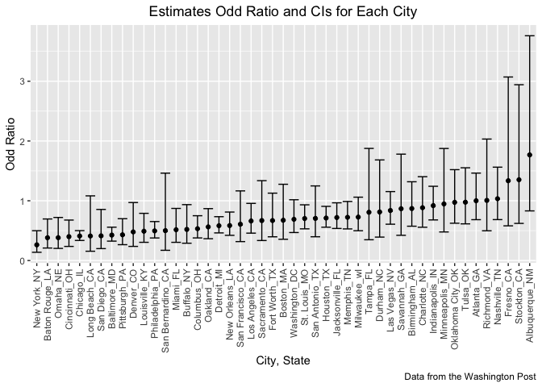

p8105_hw6_jz3571
================
Junyan Zhu
2022-11-29

``` r
library(tidyverse)
library(modelr)
```

## Problem 1

``` r
weather_df = 
  rnoaa::meteo_pull_monitors(
    c("USW00094728"),
    var = c("PRCP", "TMIN", "TMAX"), 
    date_min = "2017-01-01",
    date_max = "2017-12-31") %>%
  mutate(
    name = recode(id, USW00094728 = "CentralPark_NY"),
    tmin = tmin / 10,
    tmax = tmax / 10) %>%
  select(name, id, everything())
```

    ## Registered S3 method overwritten by 'hoardr':
    ##   method           from
    ##   print.cache_info httr

    ## using cached file: ~/Library/Caches/R/noaa_ghcnd/USW00094728.dly

    ## date created (size, mb): 2022-09-29 10:34:56 (8.401)

    ## file min/max dates: 1869-01-01 / 2022-09-30

#### Draw 5000 bootstrap samples and estimate R-square for each

``` r
bootstrap_df = 
  weather_df %>% 
  bootstrap(n = 5000, id = "strap_number")

rsquare_df = 
  bootstrap_df %>% 
  mutate(
    models = map(strap, ~ lm(tmax ~ tmin, data = .x)),
    results = map(models, broom::glance)
    ) %>% 
  unnest(results) %>% 
  select(strap_number, r.squared)
```

#### Plot the distribution of estimated R-square

``` r
rsquare_df %>% 
  ggplot(aes(x = r.squared)) +
  geom_density() +
  labs(x = "R_squared estimates",
       y = "Density",
       title = "Distribution of R-squared estimates") +
  theme(plot.title = element_text(hjust = 0.5))
```

<!-- -->

#### 95% CI for R-squared

``` r
quantile(rsquare_df$r.squared, c(0.025, 0.975))
```

    ##      2.5%     97.5% 
    ## 0.8943513 0.9273720

#### Produce estimates of log(beta_0 \* beta_1) for each bootstrap sample

``` r
log_df = 
  bootstrap_df %>% 
  mutate(
    models = map(strap, ~ lm(tmax ~ tmin, data = .x)),
    results = map(models, broom::tidy)
    ) %>% 
  unnest(results) %>% 
  select(strap_number, term, estimate) %>% 
  pivot_wider(
    names_from = "term",
    values_from = "estimate"
  ) %>% 
  janitor::clean_names() %>% 
  rename(beta_0 = intercept, beta_1 = tmin) %>% 
  mutate(log_beta0_times_beta1 = log(beta_0 * beta_1))
```

#### Plot the distribution of estimates of log(beta_0 \* beta_1)

``` r
log_df %>% 
  ggplot(aes(x = log_beta0_times_beta1)) +
  geom_density() +
  labs(x = "log(beta_0 * beta_1)",
       y = "Density",
       title = "Distribution of estimates of log(beta_0 * beta_1)") +
  theme(plot.title = element_text(hjust = 0.5))
```

<!-- -->

From the graphs pf distribution above, we can see the distribution of R
square is basically normal and mean is about 0.91. Besides, the the plot
of log(beta_0 \* beta_1) shows that the value of the value of log(beta_0
\* beta_1) is also normally distributed around the 2.03.

#### 95% CI for log(beta_0 \* beta_1)

``` r
quantile(log_df$log_beta0_times_beta1, c(0.025, 0.975))
```

    ##     2.5%    97.5% 
    ## 1.965428 2.060161

## Problem 2

``` r
homicide_df = read_csv("./data/homicide-data.csv")
```

    ## Rows: 52179 Columns: 12
    ## ── Column specification ────────────────────────────────────────────────────────
    ## Delimiter: ","
    ## chr (9): uid, victim_last, victim_first, victim_race, victim_age, victim_sex...
    ## dbl (3): reported_date, lat, lon
    ## 
    ## ℹ Use `spec()` to retrieve the full column specification for this data.
    ## ℹ Specify the column types or set `show_col_types = FALSE` to quiet this message.

The raw data from Washington Post homicide data has 52179 rows and 12
columns. It recorded 52179 homicide cases with 12 variables, including
uid, reported date, victim’s last name, victim’s first name, victim’s
race, age, sex, city, state, the location of the killing in latitude and
longitude and also disposition

#### Create a city_state variable and clean data

``` r
homicide_clean = homicide_df %>% 
  mutate(city_state = str_c(city, state, sep = "_"),
         victim_age = as.numeric(victim_age),
         resolved = case_when(
           disposition == "Closed without arrest" ~ 0,
           disposition == "Open/No arrest" ~ 0,
           disposition == "Closed by arrest" ~ 1
         ) ) %>% 
  filter(victim_race %in% c("Black", "White"),
         city_state != "Tulsa_AL",
         city_state != "Dallas_TX",
         city_state != "Phoenix_AZ",
         city_state != "Kansas City_MO") %>% 
   select(city_state, resolved, victim_age, victim_race, victim_sex)
```

    ## Warning in mask$eval_all_mutate(quo): NAs introduced by coercion

#### Fit a logistic regression for resolved vs unresolved for the city of Baltimore_MD

``` r
baltimore_df = 
  homicide_clean %>% 
  filter(city_state =="Baltimore_MD")

baltimore_fit =
  baltimore_df %>% 
  glm(resolved ~ victim_age + victim_race + victim_sex, data = ., family = "binomial") %>% 
  broom::tidy() %>% 
  filter(term == "victim_sexMale") %>%
  mutate(odd_ratio = exp(estimate),
         CI_lower = exp(estimate - 1.96*std.error),
         CI_upper = exp(estimate + 1.96*std.error)) %>% 
  select(term, odd_ratio, starts_with("CI"))

baltimore_fit %>% 
  knitr::kable(digit = 3)
```

| term           | odd_ratio | CI_lower | CI_upper |
|:---------------|----------:|---------:|---------:|
| victim_sexMale |     0.426 |    0.325 |    0.558 |

#### Run glm for each of the cities in your dataset, and extract the adjusted odds ratio (and CI) for solving homicides comparing male victims to female victims.

``` r
all_glm = 
  homicide_clean %>% 
  nest(data = -city_state) %>% 
  mutate(
    models = map(.x = data, ~ glm(resolved ~ victim_age + victim_race + victim_sex, data = .x, family = "binomial")),
    results = map(models, broom::tidy)
    ) %>% 
  unnest(results) %>% 
  filter(term == "victim_sexMale") %>% 
  mutate(odd_ratio = exp(estimate),
         CI_lower = exp(estimate - 1.96*std.error),
         CI_upper = exp(estimate + 1.96*std.error)) %>% 
  select(city_state, odd_ratio, starts_with("CI"))
  
all_glm %>% 
  knitr::kable(digit = 3)
```

| city_state        | odd_ratio | CI_lower | CI_upper |
|:------------------|----------:|---------:|---------:|
| Albuquerque_NM    |     1.767 |    0.831 |    3.761 |
| Atlanta_GA        |     1.000 |    0.684 |    1.463 |
| Baltimore_MD      |     0.426 |    0.325 |    0.558 |
| Baton Rouge_LA    |     0.381 |    0.209 |    0.695 |
| Birmingham_AL     |     0.870 |    0.574 |    1.318 |
| Boston_MA         |     0.674 |    0.356 |    1.276 |
| Buffalo_NY        |     0.521 |    0.290 |    0.935 |
| Charlotte_NC      |     0.884 |    0.557 |    1.403 |
| Chicago_IL        |     0.410 |    0.336 |    0.501 |
| Cincinnati_OH     |     0.400 |    0.236 |    0.677 |
| Columbus_OH       |     0.532 |    0.378 |    0.750 |
| Denver_CO         |     0.479 |    0.236 |    0.971 |
| Detroit_MI        |     0.582 |    0.462 |    0.734 |
| Durham_NC         |     0.812 |    0.392 |    1.683 |
| Fort Worth_TX     |     0.669 |    0.397 |    1.127 |
| Fresno_CA         |     1.335 |    0.580 |    3.071 |
| Houston_TX        |     0.711 |    0.558 |    0.907 |
| Indianapolis_IN   |     0.919 |    0.679 |    1.242 |
| Jacksonville_FL   |     0.720 |    0.537 |    0.966 |
| Las Vegas_NV      |     0.837 |    0.608 |    1.154 |
| Long Beach_CA     |     0.410 |    0.156 |    1.082 |
| Los Angeles_CA    |     0.662 |    0.458 |    0.956 |
| Louisville_KY     |     0.491 |    0.305 |    0.790 |
| Memphis_TN        |     0.723 |    0.529 |    0.988 |
| Miami_FL          |     0.515 |    0.304 |    0.872 |
| Milwaukee_wI      |     0.727 |    0.499 |    1.060 |
| Minneapolis_MN    |     0.947 |    0.478 |    1.875 |
| Nashville_TN      |     1.034 |    0.685 |    1.562 |
| New Orleans_LA    |     0.585 |    0.422 |    0.811 |
| New York_NY       |     0.262 |    0.138 |    0.499 |
| Oakland_CA        |     0.563 |    0.365 |    0.868 |
| Oklahoma City_OK  |     0.974 |    0.624 |    1.520 |
| Omaha_NE          |     0.382 |    0.203 |    0.721 |
| Philadelphia_PA   |     0.496 |    0.378 |    0.652 |
| Pittsburgh_PA     |     0.431 |    0.265 |    0.700 |
| Richmond_VA       |     1.006 |    0.498 |    2.033 |
| San Antonio_TX    |     0.705 |    0.398 |    1.249 |
| Sacramento_CA     |     0.669 |    0.335 |    1.337 |
| Savannah_GA       |     0.867 |    0.422 |    1.780 |
| San Bernardino_CA |     0.500 |    0.171 |    1.462 |
| San Diego_CA      |     0.413 |    0.200 |    0.855 |
| San Francisco_CA  |     0.608 |    0.317 |    1.165 |
| St. Louis_MO      |     0.703 |    0.530 |    0.932 |
| Stockton_CA       |     1.352 |    0.621 |    2.942 |
| Tampa_FL          |     0.808 |    0.348 |    1.876 |
| Tulsa_OK          |     0.976 |    0.614 |    1.552 |
| Washington_DC     |     0.690 |    0.468 |    1.017 |

#### Plot he estimated ORs and CIs for each city

``` r
all_glm %>% 
  mutate(city_state = fct_reorder(city_state, odd_ratio)) %>% 
  ggplot(aes(x = city_state, y = odd_ratio)) +
  geom_point() + 
  geom_errorbar(aes(ymin = CI_lower, ymax = CI_upper)) +
  theme(axis.text.x = element_text(angle = 90, vjust = 0.5, hjust = 1)) +
  labs(
    title = "Estimates Odd Ratio and CIs for Each City",
    x = "City, State",
    y = "Odd Ratio",
    caption = "Data from the Washington Post") +
   theme(plot.title = element_text(hjust = 0.5))
```

<!-- -->

Most of the cities have odd ratio between 0 and 1 for solving homicides
comparing male victims to female victims. `Fresno_CA`, `Stockton_CA` and
`Albuquerque_NM` have larger odd ratios between 1 and 2. The 95%
confidence interval for these three cities are also wider than other
cities indicating larger standard error.

## Problem 3

#### Load and clean the data for regression analysis

``` r
birthweight_df = read_csv("./data/birthweight.csv")
```

    ## Rows: 4342 Columns: 20
    ## ── Column specification ────────────────────────────────────────────────────────
    ## Delimiter: ","
    ## dbl (20): babysex, bhead, blength, bwt, delwt, fincome, frace, gaweeks, malf...
    ## 
    ## ℹ Use `spec()` to retrieve the full column specification for this data.
    ## ℹ Specify the column types or set `show_col_types = FALSE` to quiet this message.

``` r
bw_clean = 
  birthweight_df %>% 
  janitor::clean_names() %>% 
  mutate(
    babysex = factor(babysex),
    babysex = fct_recode(babysex, 
                         male = "1", 
                         female = "2"),
    frace = factor(frace),
    frace = fct_recode(frace, 
                       white = "1", 
                       black = "2", 
                       asian = "3", 
                       puerto_rican = "4", 
                       other = "8"),
    malform = factor(malform),
    malform = fct_recode(malform, 
                         absent = "0", 
                         present = "1"),
    mrace = factor(mrace),
    mrace = fct_recode(mrace, 
                       white = "1", 
                       black = "2",
                       asian = "3",
                       puerto_rican = "4"))

# check missing values
sum(is.na(bw_clean))
```

    ## [1] 0

The resulting dataset `bw_clean` contains 20 variables: babysex, bhead,
blength, bwt, delwt, fincome, frace, gaweeks, malform, menarche,
mheight, momage, mrace, parity, pnumlbw, pnumsga, ppbmi, ppwt, smoken,
wtgain. This dataset has 4342 observations and 0 missing value. Numeric
variables `babysex`, `frace`, `malform`, and `mrace` were converted into
factor variables.

#### Propose a regression model for birthweight

###### view the data

``` r
bw_clean %>% 
  lm(bwt ~ ., data =.) %>% 
  broom::tidy()
```

    ## # A tibble: 25 × 5
    ##    term               estimate std.error statistic   p.value
    ##    <chr>                 <dbl>     <dbl>     <dbl>     <dbl>
    ##  1 (Intercept)       -6265.      660.      -9.49   3.81e- 21
    ##  2 babysexfemale        28.7       8.47     3.39   7.02e-  4
    ##  3 bhead               131.        3.45    37.9    2.16e-271
    ##  4 blength              75.0       2.02    37.1    1.75e-261
    ##  5 delwt                 4.10      0.395   10.4    5.62e- 25
    ##  6 fincome               0.290     0.180    1.61   1.07e-  1
    ##  7 fraceblack           14.3      46.2      0.311  7.56e-  1
    ##  8 fraceasian           21.2      69.3      0.306  7.59e-  1
    ##  9 fracepuerto_rican   -47.0      44.7     -1.05   2.93e-  1
    ## 10 fraceother            4.30     74.1      0.0580 9.54e-  1
    ## # … with 15 more rows

###### use the both_way stepwise model selection

``` r
stepwise_model = step(lm(bwt ~ . ,data = bw_clean), direction = "both", trace = FALSE)
summary(stepwise_model)
```

    ## 
    ## Call:
    ## lm(formula = bwt ~ babysex + bhead + blength + delwt + fincome + 
    ##     gaweeks + mheight + mrace + parity + ppwt + smoken, data = bw_clean)
    ## 
    ## Residuals:
    ##      Min       1Q   Median       3Q      Max 
    ## -1097.18  -185.52    -3.39   174.14  2353.44 
    ## 
    ## Coefficients:
    ##                     Estimate Std. Error t value Pr(>|t|)    
    ## (Intercept)       -6098.8219   137.5463 -44.340  < 2e-16 ***
    ## babysexfemale        28.5580     8.4549   3.378 0.000737 ***
    ## bhead               130.7770     3.4466  37.944  < 2e-16 ***
    ## blength              74.9471     2.0190  37.120  < 2e-16 ***
    ## delwt                 4.1067     0.3921  10.475  < 2e-16 ***
    ## fincome               0.3180     0.1747   1.820 0.068844 .  
    ## gaweeks              11.5925     1.4621   7.929 2.79e-15 ***
    ## mheight               6.5940     1.7849   3.694 0.000223 ***
    ## mraceblack         -138.7925     9.9071 -14.009  < 2e-16 ***
    ## mraceasian          -74.8868    42.3146  -1.770 0.076837 .  
    ## mracepuerto_rican  -100.6781    19.3247  -5.210 1.98e-07 ***
    ## parity               96.3047    40.3362   2.388 0.017004 *  
    ## ppwt                 -2.6756     0.4274  -6.261 4.20e-10 ***
    ## smoken               -4.8434     0.5856  -8.271  < 2e-16 ***
    ## ---
    ## Signif. codes:  0 '***' 0.001 '**' 0.01 '*' 0.05 '.' 0.1 ' ' 1
    ## 
    ## Residual standard error: 272.3 on 4328 degrees of freedom
    ## Multiple R-squared:  0.7181, Adjusted R-squared:  0.7173 
    ## F-statistic: 848.1 on 13 and 4328 DF,  p-value: < 2.2e-16

According to the results from both_way stepwise model selection , we
have the optimal regression model: bwt \~ babysex + bhead + blength +
delwt + fincome + gaweeks + mheight + mrace + parity + ppwt + smoken.
The multiple r-squared is 0.7181, and adjusted r-squared is 0.7173. The
p value is smaller than 2.2e-16.

#### show a plot of model residuals against fitted values

``` r
residual_plot =
  bw_clean %>% 
  add_predictions(stepwise_model) %>% 
  add_residuals(stepwise_model) %>% 
  ggplot(aes(x = pred, y = resid)) +
  geom_point(alpha = 0.5) +
  geom_smooth(formula = 'y ~ x',method = "lm", se = FALSE) +
  labs(title = "Fitted Values vs. Residuals",
       x = "Fitted Values", 
       y = "Residuals",) +
  theme(plot.title = element_text(hjust = 0.5))

residual_plot
```

<!-- -->

From the graph, we could see a big cluster of points around fitted
values equal 2000 - 4000 where the model residuals tend to evenly
distributed around 0.

#### Compare my model to two others

``` r
model_1 = lm(bwt ~ blength + gaweeks, data = bw_clean)

model_2 = lm(bwt ~ bhead + blength + babysex + bhead * blength + bhead * babysex + blength * babysex + bhead * blength * babysex, data = bw_clean)
```

``` r
cv_df = 
  crossv_mc(bw_clean, 100) %>% 
  mutate(
    train = map(train, as_tibble),
    test = map(test, as_tibble)
  ) %>% 
  mutate(
    model_1  = map(train, ~lm(bwt ~ blength + gaweeks, data = .x)),
    model_2  = map(train, ~lm(bwt ~ bhead * blength * babysex, data = .x)),
    stepwise_model  = map(train, ~lm(bwt ~ babysex + bhead + blength + delwt + fincome + gaweeks + mheight + mrace + parity + ppwt + smoken, data = .x ))) %>% 
  mutate(
    rmse_model_1 = map2_dbl(model_1, test, ~rmse(model = .x, data = .y)),
    rmse_model_2    = map2_dbl(model_2, test, ~rmse(model = .x, data = .y)),
    rmse_stepwise = map2_dbl(stepwise_model, test, ~rmse(model = .x, data = .y)))
```

``` r
cv_df %>% 
  select(starts_with("rmse")) %>% 
  pivot_longer(
    everything(),
    names_to = "model",
    values_to = "rmse",
    names_prefix = "rmse_"
  ) %>% 
  mutate(model = fct_reorder(model, rmse)) %>% 
  ggplot(aes(x = model, y = rmse)) +
  geom_violin() +
  labs(title = "Cross Validation Comparisons",
       x = "Model",
       y = "RMSE") +
  theme(plot.title = element_text(hjust = 0.5))
```

<!-- -->

From the violin plot we can see that model `stepwise_model` (bwt \~
babysex + bhead + blength + delwt + fincome + gaweeks + mheight +
mrace + parity + ppwt + smoken) has the lowest rmse than `model_1` and
`model_2`. Therefore, `stepwise_model` has the best performance in
predicting child birthweight among the three models.
